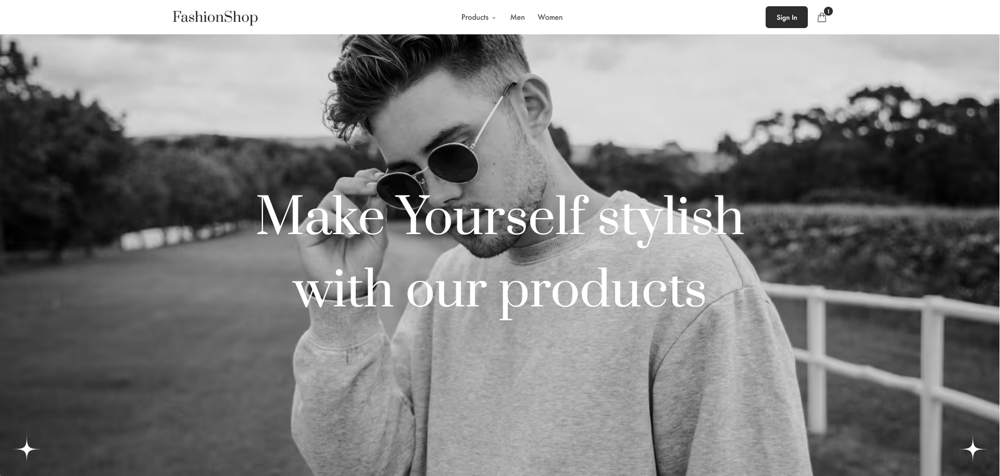

<h1 align="center">Hey 👋, I'm Mohamed Oulahguine</h1>

### Let's Connect

  I'm always open to connect, collaborate, or chat about anything dev-related.

  📍 live in Istanbul, Turkey (from Morocco )  
  ✉️ <a href="mailto:moulahguine@example.com">moulahguine@example.com</a>  
  🌐 <a href="https://mohamedoulahguine.com" target="_blank">mohamedoulahguine.com</a>

  
  
  
  

---

### About Me && Tech Stack

  

I’m a Frontend Developer with 3+ years of experience delivering SPAs, dashboards, and e-commerce platforms. I focus on performance, clean state management, and accessible interfaces that feel fast on any device.
 
I work closely with designers and backend engineers, turning Figma designs into components, write maintainable code, and review PRs to keep quality high
 

I'm actively seeking Frontend Development opportunities and collaborations where I can contribute to impactful projects..

I'm comfortable working with:

<ul>
  <li><strong>Core Web:</strong> HTML, CSS, Sass, JavaScript, TypeScript</li>
  <li><strong>Frameworks & Libraries:</strong> React, Redux, React Query, Framer Motion</li>
  <li><strong>Styling:</strong> Tailwind CSS, Material UI (MUI)</li>
  <li><strong>Build & Tooling:</strong> Vite, Jest (testing)</li>
  <li><strong>Version Control:</strong> Git, GitHub</li>
  <li><strong>Editors & Tools:</strong> VS Code, Cursor AI, CodePen</li>
</ul>

  
  
  
  
  
  
  
  
  
  
  
  
  
  

---

### Featured Projects

<table>
  <tr>
    <td style="width: 50%; vertical-align: top; text-align: center; padding: 10px;">
      <h3>✅ Personal Portfolio Website</h3>
      
A fully responsive personal portfolio to showcase my skills, projects, and experience. Built with React, Sass, and modern tooling for clean design and smooth interactions.

      
      

        
        
      

    </td>

    <td style="width: 50%; vertical-align: top; text-align: center; padding: 10px;">
      <h3>✅ Fashion Shop – E-Commerce Website</h3>
      
A responsive and modern e-commerce web application with product listings, categories, and a smooth shopping experience. Built with React, Tailwind CSS, and modern tooling.

      
      

        
        
      

    </td>
  </tr>
</table>
