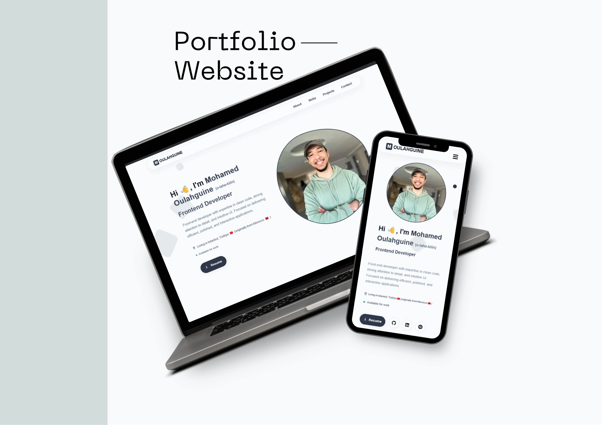
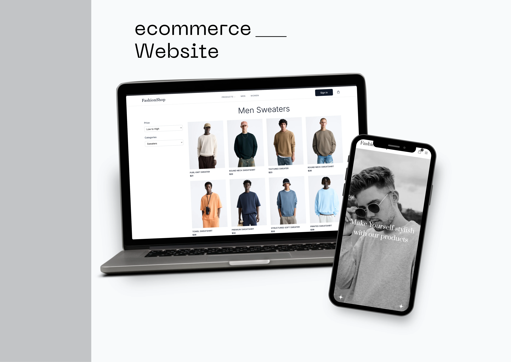
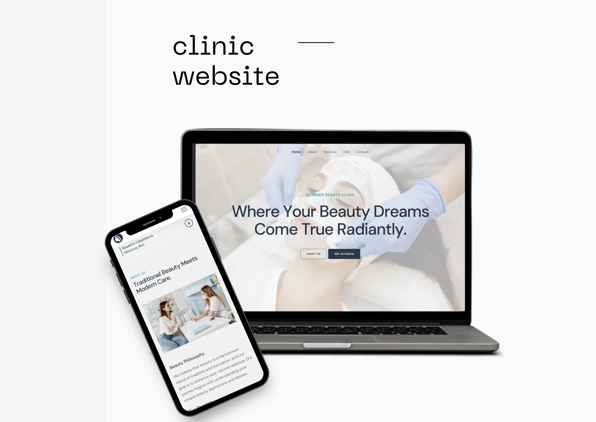
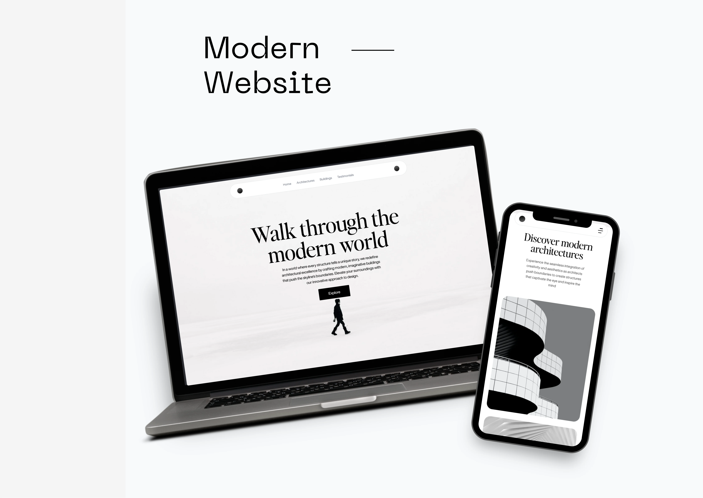

<!-- <h1 align="center">Hey 👋, I'm Mohamed Oulahguine (o-laha-kiin)</h1>

  📍 live in Istanbul, Turkey (from Morocco)  
  ✉️ <a href="mailto:hello@mohamedoulahguine.com">hello@mohamedoulahguine.com</a>  
  🌐 <a href="https://mohamedoulahguine.com" target="_blank">www.mohamedoulahguine.com</a>

  
  
  
  

---

### About Me && Tech Stack

  

I’m a Frontend Developer with 3+ years of experience delivering SPAs, dashboards, and e-commerce platforms. I focus on performance, clean state management, and accessible interfaces that feel fast on any device.
 
I work closely with designers and backend engineers, turning Figma designs into components, write maintainable code, and review PRs to keep quality high
 

I'm actively seeking Frontend Development opportunities and collaborations where I can contribute to impactful projects..

I'm comfortable working with:

  
  
  
  
  
  
  
  
  
  
  
  
  
  
  
  
  

<ul>
  <li><strong>Core Web:</strong> HTML, CSS, Sass, JavaScript, TypeScript</li>
  <li><strong>Frameworks & Libraries:</strong> React, Next.js, Redux, React Query, Framer Motion</li>
  <li><strong>Styling:</strong> Tailwind CSS, Material UI (MUI)</li>
  <li><strong>Build & Tooling:</strong> Vite, Jest (testing)</li>
  <li><strong>Version Control:</strong> Git, GitHub</li>
  <li><strong>Editors & Tools:</strong> VS Code, Cursor AI, CodePen</li>
</ul>

---

### Featured Projects

<!-- <table>
  <tr>
    <td align="center">
      <h3>✅ Personal Portfolio Website</h3>
      
         
Enhanced my skills in optimizing visuals and responsive design. Tackled challenges with lazy-loading, smooth animations, and scaling UI across devices, delivering a fast and polished experience.

      

        <a href="https://github.com/moulahguine/my_portfolio-moulahguine" target="_blank">
          Repo
        </a> | 
        <a href="https://mohamedoulahguine.com" target="_blank">
          Live Demo
        </a>
      

        

        
        
        
      

    </td>
    <td align="center">
      <h3>✅ Fashion Shop – E-Commerce Website</h3>
      
       
Mastered dynamic product management and interactive UI behaviors. Overcame obstacles in responsive grids, mobile navigation, and performance tuning to create a seamless shopping experience.

      

        <a href="https://github.com/moulahguine/fashion-shop" target="_blank">
          Repo
        </a> | 
        <a href="https://fashionshop-site.vercel.app/" target="_blank">
          Live Demo
        </a>
      

       

        
        
        
        
      

    </td>
  </tr>
  <tr>
    <td align="center">
      <h3>🚫 Clinic Website "comming soon"</h3>
      
       
Refined my approach to building complex dashboards. Addressed challenges in displaying structured data, creating responsive cards, and improving accessibility for better usability.

      

        <a href="https://github.com/moulahguine/clinic-dashboard" target="_blank">
          Repo
        </a> | 
        <a href="https://clinic-dashboard.netlify.app/" target="_blank">
          Live Demo
        </a>
      

       

    
    
    
    
  

    </td>
    <td align="center">
      <h3>✅ Modern Landing Page</h3>
      
      
Focused on lightweight, high-performance interface design. Handled responsive layouts, smooth scrolling, and cross-device consistency to deliver a visually clean and engaging landing page.

      

        <a href="https://github.com/moulahguine/modern_world" target="_blank">
          Repo
        </a> | 
        <a href="https://modernworldx.netlify.app/" target="_blank">
          Live Demo
        </a>
      

       

  

    </td>
  </tr>
</table> --> -->

<!-- HERO SECTION -->
<h1 align="center" style="font-size: 42px; font-weight: 800;">
  Mohamed Oulahguine
</h1>

<h3 align="center">
Frontend Engineer • React & Next.js • Building Scalable and Maintainable UI Systems
</h3>

  📍 Istanbul, Turkey (from Morocco)  
  ✉️ <a href="mailto:hello@mohamedoulahguine.com">hello@mohamedoulahguine.com</a>  
  🌐 <a href="https://mohamedoulahguine.com" target="_blank">Portfolio Website</a>

  
  
  
  

---

## My Approach

I started frontend development in 2021 without following a clear path, just trying to understand how things actually work. Over time, that pushed me to focus less on surface-level UI and more on structure, rendering behavior, and how applications hold up as they grow.

Since then, I’ve worked on different kinds of projects including dashboards, portfolios, landing pages, and e-commerce interfaces, along with client work that required real decisions, not just implementation. That’s where my focus shifted toward building interfaces as systems, keeping them predictable, easy to extend, and maintainable over time.

What matters to me is how the interface behaves after it’s built. I pay attention to component structure, state management, and the small details that usually cause problems later if they’re ignored. The goal is to keep things clear, stable, and easy for others to work with.

Currently **open to Frontend roles & freelance collaborations**.

---

## Skills & Technologies

  

| Core Web | Frameworks | Styling | Tools |
|----------|------------|--------|------|
| HTML, CSS, JS, TS | React, Next.js, Redux | Tailwind, MUI, Sass | Git, Jest, Vite |

---

## 💼 Featured Projects

<table>
  <tr>
    <td align="center">
      <h3>Personal Portfolio</h3>
      
      
Fast, responsive portfolio with optimized assets and smooth UI animations.

      

        <a href="https://github.com/moulahguine/my_portfolio-moulahguine">Repo</a> |
        <a href="https://mohamedoulahguine.com">Live</a>
      

    </td>

    <td align="center">
      <h3>Fashion Shop</h3>
      
      
E-commerce app with dynamic UI, responsive layout, and performance tuning.

      

        <a href="https://github.com/moulahguine/fashion-shop">Repo</a> |
        <a href="https://fashionshop-site.vercel.app/">Live</a>
      

    </td>
  </tr>

  <tr>
    <td align="center">
      <h3>Clinic Dashboard</h3>
      
      
Data-driven dashboard with responsive UI and accessibility improvements.

      

        <a href="https://github.com/moulahguine/clinic-dashboard">Repo</a> |
        <a href="https://clinic-dashboard.netlify.app/">Live</a>
      

    </td>

    <td align="center">
      <h3>Modern Landing Page</h3>
      
      
Clean, high-performance landing page with smooth scrolling and layout precision.

      

        <a href="https://github.com/moulahguine/modern_world">Repo</a> |
        <a href="https://modernworldx.netlify.app/">Live</a>
      

    </td>
  </tr>
</table>

---

## 📬 Let's Connect

  I'm always open to discussing new opportunities, collaborations, or interesting projects.

  <a href="mailto:hello@mohamedoulahguine.com">Send me an email</a>

