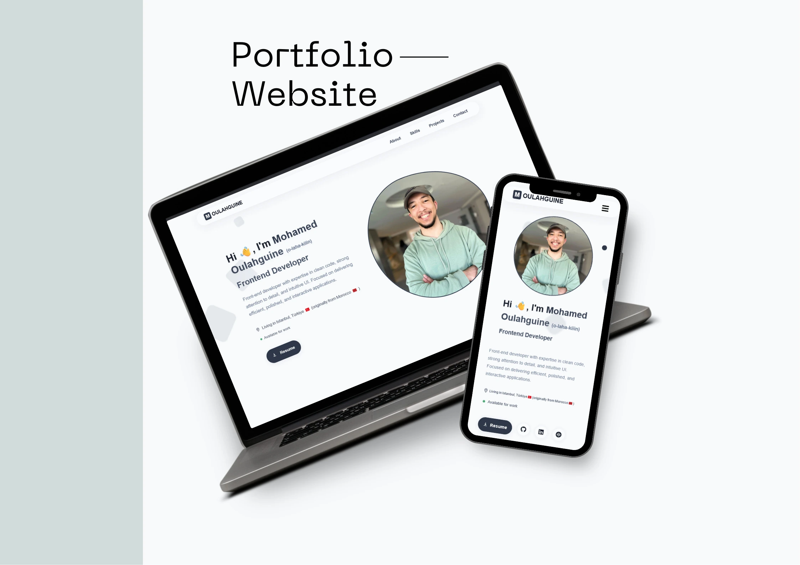
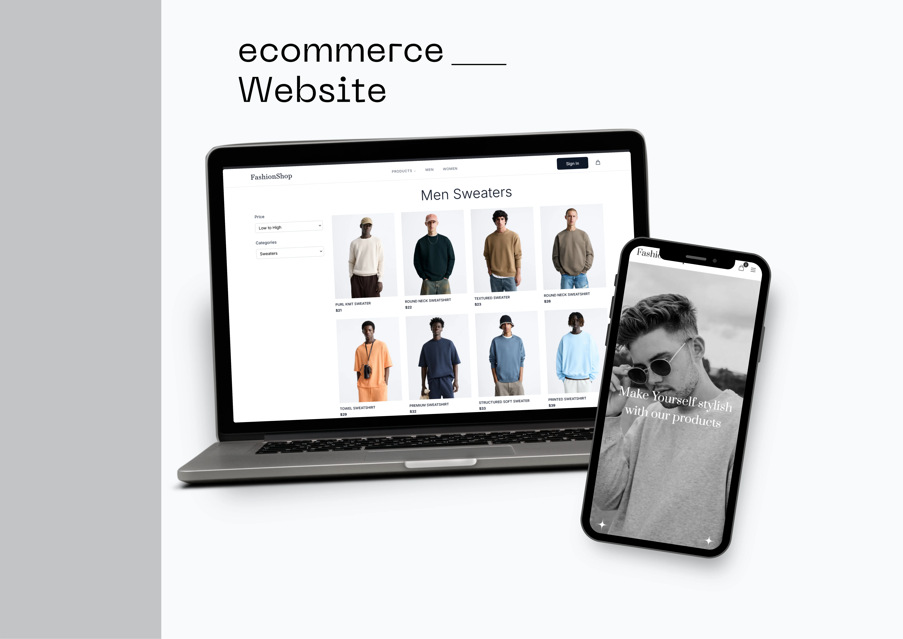

<h1 align="center">Hey 👋, I'm Mohamed Oulahguine (o-laha-kiin)</h1>

  📍 live in Istanbul, Turkey (from Morocco)  
  ✉️ <a href="mailto:mohamedoulahguine@gmail.com">mohamedoulahguine@gmail.com</a>  
  🌐 <a href="https://mohamedoulahguine.com" target="_blank">mohamedoulahguine.com</a>

  
  
  
  

---

### About Me && Tech Stack

  

I’m a Frontend Developer with 3+ years of experience delivering SPAs, dashboards, and e-commerce platforms. I focus on performance, clean state management, and accessible interfaces that feel fast on any device.
 
I work closely with designers and backend engineers, turning Figma designs into components, write maintainable code, and review PRs to keep quality high
 

I'm actively seeking Frontend Development opportunities and collaborations where I can contribute to impactful projects..

I'm comfortable working with:

  
  
  
  
  
  
  
  
  
  
  
  
  
  
  
  
  

<ul>
  <li><strong>Core Web:</strong> HTML, CSS, Sass, JavaScript, TypeScript</li>
  <li><strong>Frameworks & Libraries:</strong> React, Next.js, Redux, React Query, Framer Motion</li>
  <li><strong>Styling:</strong> Tailwind CSS, Material UI (MUI)</li>
  <li><strong>Build & Tooling:</strong> Vite, Jest (testing)</li>
  <li><strong>Version Control:</strong> Git, GitHub</li>
  <li><strong>Editors & Tools:</strong> VS Code, Cursor AI, CodePen</li>
</ul>

---

### Featured Projects

<table>
  <tr>
    <td align="center">
      <h3>✅ Personal Portfolio Website</h3>
      
         
Enhanced my skills in optimizing visuals and responsive design. Tackled challenges with lazy-loading, smooth animations, and scaling UI across devices, delivering a fast and polished experience.

      

        <a href="https://github.com/moulahguine/my_portfolio-moulahguine" target="_blank">
          Repo
        </a> | 
        <a href="https://mohamedoulahguine.com" target="_blank">
          Live Demo
        </a>
      

        

        
        
        
      

    </td>
    <td align="center">
      <h3>✅ Fashion Shop – E-Commerce Website</h3>
      
       
Mastered dynamic product management and interactive UI behaviors. Overcame obstacles in responsive grids, mobile navigation, and performance tuning to create a seamless shopping experience.

      

        <a href="https://github.com/moulahguine/fashion-shop" target="_blank">
          Repo
        </a> | 
        <a href="https://e-fashionshop.netlify.app/" target="_blank">
          Live Demo
        </a>
      

       

        
        
        
        
      

    </td>
  </tr>
  <tr>
    <td align="center">
      <h3>✅ Clinic Website</h3>
      
       
Refined my approach to building complex dashboards. Addressed challenges in displaying structured data, creating responsive cards, and improving accessibility for better usability.

      

        <a href="https://github.com/moulahguine/clinic-dashboard" target="_blank">
          Repo
        </a> | 
        <a href="https://clinic-dashboard.netlify.app/" target="_blank">
          Live Demo
        </a>
      

       

    
    
    
    
  

    </td>
    <td align="center">
      <h3>✅ Modern Landing Page</h3>
      
      
Focused on lightweight, high-performance interface design. Handled responsive layouts, smooth scrolling, and cross-device consistency to deliver a visually clean and engaging landing page.

      

        <a href="https://github.com/moulahguine/modern_world" target="_blank">
          Repo
        </a> | 
        <a href="https://modern-landingpage.netlify.app/" target="_blank">
          Live Demo
        </a>
      

       

  

    </td>
  </tr>
</table>
